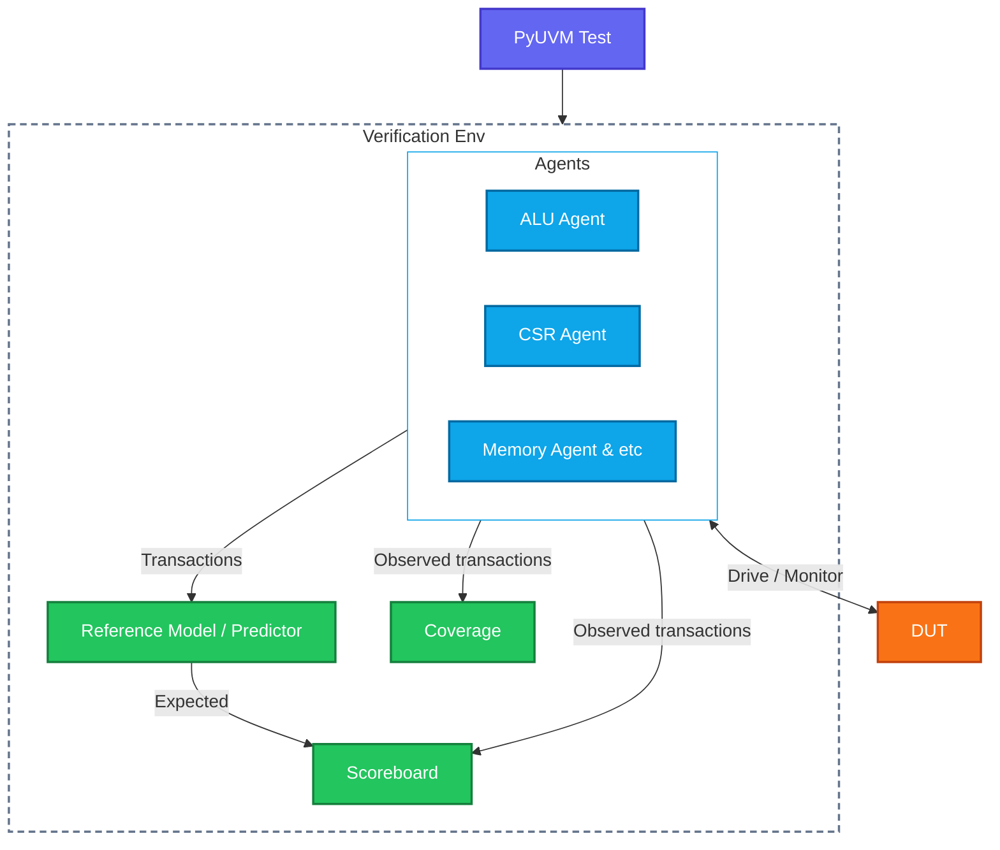
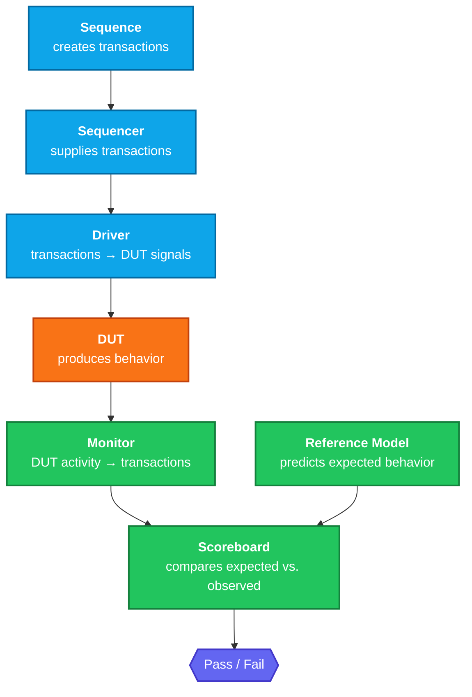
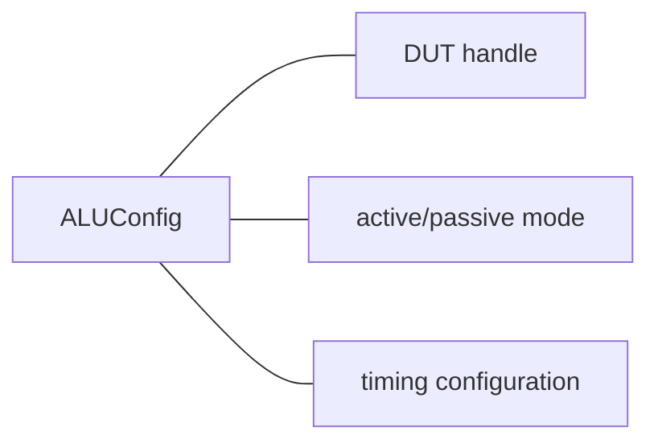
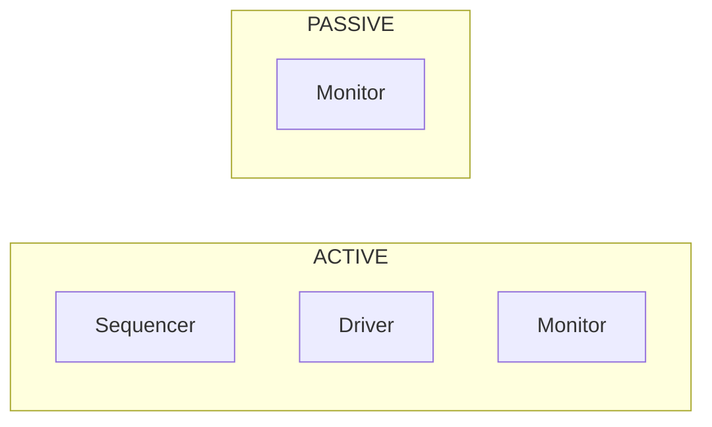
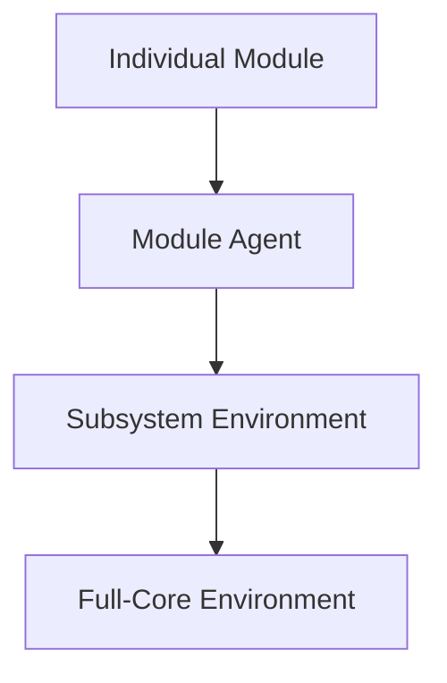
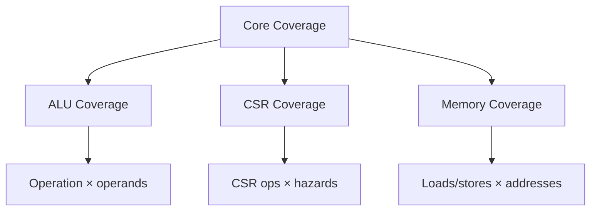
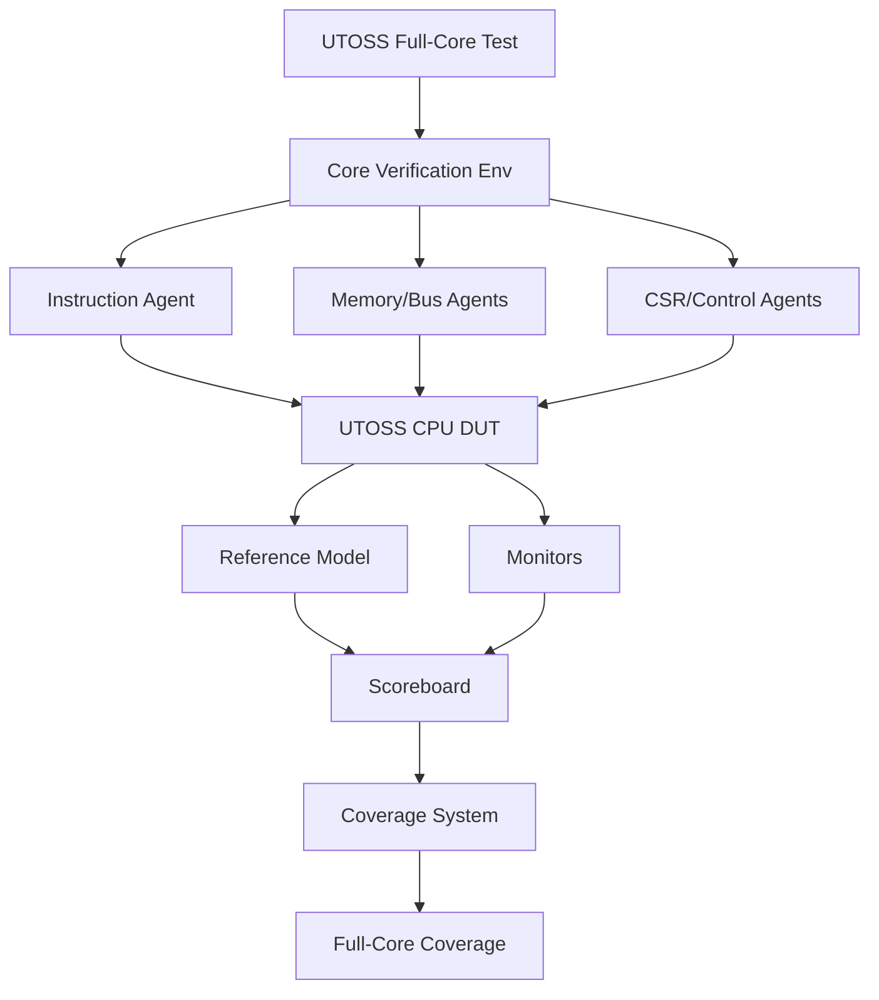
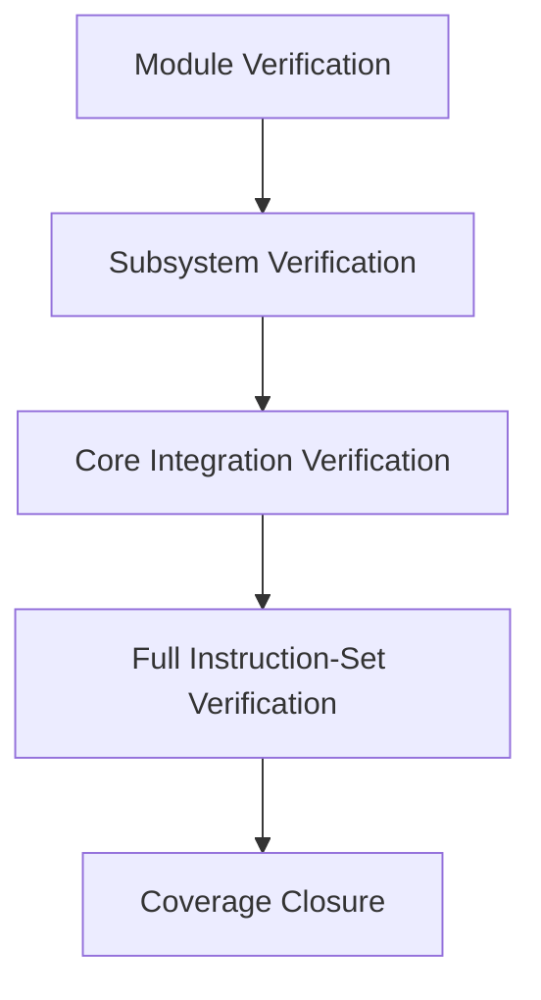
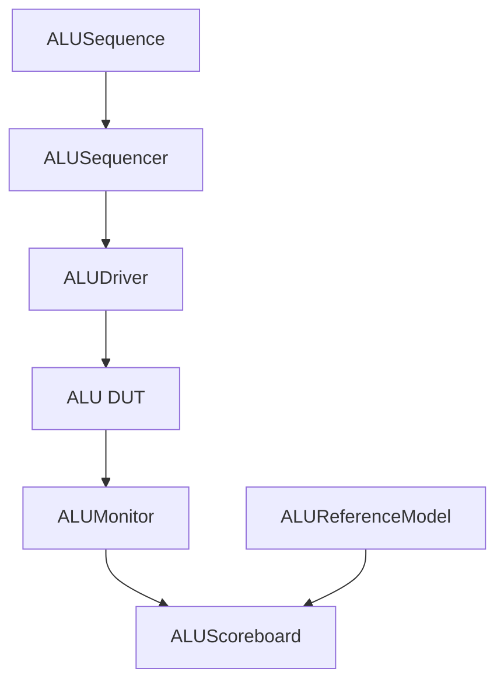

# PyUVM Verification Infrastructure

A modular Python-based verification infrastructure for the UTOSS RISC-V processor, built with PyUVM and cocotb.

The infrastructure is designed to start with focused module-level verification and scale toward comprehensive full-core verification as the processor develops.

## Running verification

The devcontainer and CI image install the dependencies from `PyUVM/requirements.txt`,
including cocotb, pyuvm, and pytest. Rebuild or pull the updated container to use them.
For a separate environment, install them with `python3 -m pip install -r PyUVM/requirements.txt`;
Verilator, a C++ compiler, make, and Python development libraries are also required.

From the repository root, run `make test_pyuvm` to execute the reference-model unit
tests and the ALU simulation. CI runs this same command and uploads the cocotb
JUnit report. To run only the simulation, use `make -C PyUVM`.

---

## Architecture

The verification infrastructure follows the UVM architecture of tests, environments, agents, sequences, drivers, monitors, scoreboards, reference models, and coverage collectors.

At a high level:



Each agent contains its own sequence, driver, and monitor (plus a sequencer when active).

### Core verification flow



* **Sequence:** determines what stimulus to generate.
* **Sequencer:** manages transaction delivery with async & await.
* **Driver:** converts high-level transactionshigh-level into signal-level DUT stimulus.
* **Monitor:** observes DUT behavior and reconstructs transactions.
* **Reference model:** independently predicts expected behavior.
* **Scoreboard:** compares expected and observed behavior.
* **Coverage:** measures which functional behaviors have been exercised.

This separation allows individual verification components to be reused as the DUT evolves.

---

## Configuration

Verification components receive environment-specific configuration through PyUVM's `ConfigDB`.

For example:



This allows the same agent to operate in different environments without hard-coding DUT connections or verification settings.

Agents can therefore be configured as either:



A passive agent can observe activity generated by another component without driving the DUT.

---

## Modular Verification Architecture

The infrastructure is intentionally organized by DUT domain.

```text
verification/
├── alu/
│   ├── transaction.py
│   ├── sequence.py
│   ├── driver.py
│   ├── monitor.py
│   ├── scoreboard.py
│   ├── reference_model.py
│   ├── coverage.py
│   └── config.py
│
├── csr/
│   └── ...
│
├── memory/
│   └── ...
│
├── register_file/
│   └── ...
│
└── core/
    └── ...
```

Each module/peripheral can have its own verification components while following the same PyUVM architecture.

This allows verification to be developed incrementally:



For example, the ALU can be verified independently before being integrated into the processor-level environment.

---

## Coverage Strategy

Coverage is also modular.

Individual coverage collectors should measure behavior relevant to their verification domain rather than placing all coverage logic into one large class.

For example:



As the processor grows, additional coverage domains can be added without modifying existing verification components.

Examples of eventual full-core coverage include:

* Instruction/opcode coverage
* ALU operation coverage
* Branch taken/not-taken coverage
* Load/store coverage
* Register usage coverage
* CSR operation coverage
* Hazard and forwarding coverage
* Exception/edge-case coverage
* Operand boundary coverage
* Functional crosses between relevant behaviors

The goal is not simply to maximize the number of executed instructions, but to measure whether the architecturally meaningful behaviors and corner cases of the processor have been exercised.

---

## Long-Term Full-Core Verification

This repository is intended to serve as a long-lived verification infrastructure rather than a collection of isolated tests.

The architecture provides an eventual entry point for full-core verification:



The intended progression is:



As new processor extensions, peripherals, pipeline features, hazards, and architectural behaviors are introduced, their verification components can be added to the existing infrastructure rather than creating independent testbenches.

---

## Current Implementation

The initial implementation uses the ALU as the first verification target.

The ALU environment demonstrates the complete PyUVM flow:



Functional coverage is collected independently through a `uvm_subscriber`.

This provides a small but complete proof-of-concept for the architecture that will eventually be applied to the complete UTOSS processor.

---

## Design Principles

**Modular**
Verification components should be reusable across different environments and integration levels.

**Independent reference models**
Expected behavior should be derived from an independent behavioral model rather than reproducing the RTL implementation.

**Configuration-driven**
DUT handles, active/passive modes, and environment-specific settings should be provided through configuration rather than hard-coded into individual components.

**Layered verification**
Module-level verification should remain useful even after components are integrated into the full processor.

**Coverage-driven development**
Verification should progressively measure whether meaningful architectural behaviors and corner cases have been exercised.

**Long-term scalability**
The infrastructure should support incremental development over the lifetime of the UTOSS processor rather than being tied to a single implementation or feature.

---

## Goal

Build a reusable PyUVM verification infrastructure that can begin with individual RTL modules and peripherals today, while providing the architectural foundation for comprehensive full-core verification and coverage closure as UTOSS evolves over the coming years.