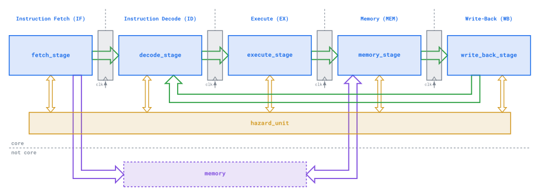

# Microarchitecture Specification

The goal of this document is to provide a reference specification for the UTOSS RISC-V core
imeplementation. This document contains the architectural details of the design of the core and its
components.

## High-level

The core is implemented using a 5-stage pipelined microarchitecture, with the following stages
present:
1. Instruction Fetch
2. Instruction Decode
3. Execute
4. Memory
5. Write-back

A hazard unit is also present to coordinate interactions with the internals of the stages to ensure
correct functioning.

The main datapath involves movement of the instruction through the pipeline, and the writeback of
the data back into the decode stage as part of write-back stage since this is where the register
file resides. Memory access is performed primarily during the corresponding stage, with fetch stage
having read-only access as well.

The overall high-level structure is defined below:

## Base ISA

### Instruction fetch stage

### Instruction decode stage

### Execute stage

### Memory stage

### Write-back stage

## Memory

## B extension

## C extension

## Zicsr extension

## M extension
