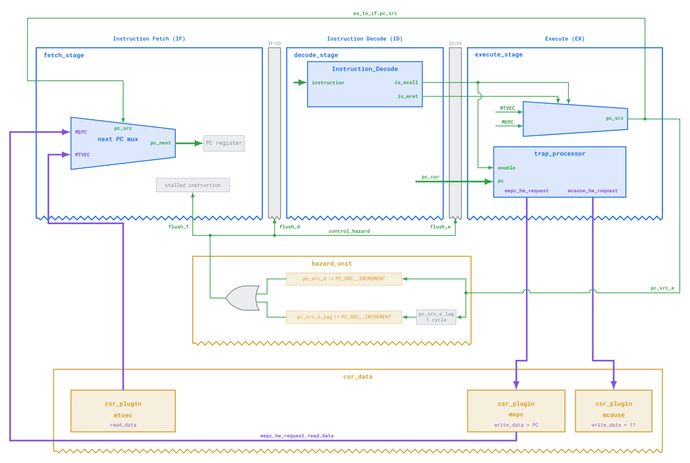

# Microarchitecture Specification

The goal of this document is to provide a reference specification for the UTOSS RISC-V core
implementation. This document contains the architectural details of the design of the core and its
components.

## High-level

The core is implemented using a 5-stage pipelined microarchitecture, with the following stages
present:
1. Instruction Fetch
2. Instruction Decode
3. Execute
4. Memory
5. Write-back

A hazard unit is also present to coordinate interactions with the internals of the stages to ensure
correct functioning.

The main datapath involves movement of the instruction through the pipeline, and the writeback of
the data back into the decode stage as part of write-back stage since this is where the register
file resides. Memory access is performed primarily during the corresponding stage, with fetch stage
having read-only access as well.

The overall high-level structure is defined below:


## Base ISA

### Instruction fetch stage

### Instruction decode stage

### Execute stage

### Memory stage

### Write-back stage

## Memory

## B extension

## C extension

## Zicsr extension

Spec: [5.1. "Zicsr" Extension for Control and Status Register (CSR) Instructions, Version
2.0](https://docs.riscv.org/reference/isa/v20260120/unpriv/zicsr.html)


`csr_decode` lives in ID, `csr_wb` lives in WB, and `csr_data` is instantiated at the
core's top level alongside the hazard unit. There is no `csr_unit` wrapper. The diagram shows
two representative plugins; hardware consumers of the exposed interface are shown in the
separate ECALL processing diagram below.

`csr_decode` produces `csr_request` with `valid`, `op` (none, write, set or clear), `address`,
`operand` (the `rs1` value or zero-extended five-bit immediate), and `write_intent`.
CSRRW[I] always has write intent; CSRRS[I] and CSRRC[I] only have it when the encoded
`rs1`/immediate is nonzero. ECALL is not a CSR read/modify/write request.

Reads are asynchronous: top-level `csr_data` uses the decode request's address and returns the
selected CSR value to ID. Both the request and the old value are clocked into ID/EX and carried
through EX/MEM and MEM/WB. In WB the old value is available for the destination register, while
`csr_wb` computes the new value: operand for write, old value OR operand for set, or old value
AND NOT operand for clear. Its `csr_wb_request` contains `address`, `data` and `write_enable`
(from `write_intent`) and feeds directly back to storage without pipeline registers.

The hazard unit compares the ID CSR address with pending writes in EX, MEM and WB using their
`write_intent` bits and addresses. It stalls fetch/decode and inserts an EX bubble for a matching
CSR dependency or an unresolved `rs1` dependency. Immediate CSR forms do not depend on a GPR.

### CSR plugins

`csr_data` houses `csr_plugin_basic` instances for software-only access and `csr_plugin`
instances with a dedicated `csr_hw_request_if` hardware interface. Both expose `read_address`,
`read_value` and `csr_wb_request` and are parameterized by `NAME`, `ADDRESS`, `RESET_VALUE`
and `WRITE_MASK`. The basic variant wraps `csr_plugin` with hardware writes disabled.

Each plugin returns zero unless its address matches. `csr_data` ORs all `read_value` outputs;
adding a CSR requires an instance and inclusion of its output in that OR. Unimplemented CSRs
read as zero and ignore writes. Masked-off bits read as their reset values.

`csr_hw_request_if` carries `write_enable`, `write_data` and `read_data`. At the clock edge,
reset has highest priority, followed by a hardware write, followed by an addressed software WB
write. The same mask applies to the visible value after either kind of write. Currently hardware
`read_data` mirrors the address-selected `read_value`; it is not an independent always-visible
read of the stored CSR.

### Implemented CSRs

| CSR | Address | Access | Write mask | Reset value |
|-----|---------|--------|------------|-------------|
| `mtvec` | `0x305` | read/write | `0xFFFFFFFC` | `0` |
| `mscratch` | `0x340` | read/write | `0xFFFFFFFF` | `0` |
| `mepc` | `0x341` | read/write + hardware | `0xFFFFFFFE` |
| `mcause` | `0x342` | read/write + hardware | `0x8000001F` |
| `mhartid` | `0xF14` | read-only | `0x00000000` | `0` |

`mtvec` supports Direct mode only: its low two bits are fixed at zero. `mepc` fixes bit zero
to zero, while `mcause` exposes the interrupt bit and the low five exception-code bits.

### `ECALL` and `MRET` processing




#### `ECALL` processing

> [**Spec**](https://docs.riscv.org/reference/isa/v20260120/priv/machine.html#2-1-3-1-environment-call-and-breakpoint)
>
> `ECALL` transfers control to the handler configured in `mtvec`. The below demo exemplifies the
> usage of this instruction:
>
> ```asm
> _start:
>     la   t0, handler
>     csrw mtvec, t0        # point mtvec register to the handler
>     ecall                 # save this PC in mepc, and the cause of call into mcause; jump to handler.
> handler:
>     csrr a0, mepc         # Address of the ecall instruction.
>     csrr a1, mcause       # 11: environment call from machine mode.
> done:
>     j    done
> ```

The diagram isolates the IF/ID/EX path and the three trap-related CSR plugins. The
`mtvec` connection shows the dedicated hardware read access: fetch selects its
asynchronous `read_data` as the next PC when EX selects `PC_SRC__MTVEC`. This interface has
no read-enable or request/response handshake. PC-source selection is EX stage logic alongside
`trap_processor`; the processor itself emits the `mepc` and `mcause` hardware writes.

Decode carries `is_ecall` and the instruction PC through ID/EX. In EX, `trap_processor`
drives the dedicated hardware interfaces to write that PC to `mepc` and machine-mode ECALL
exception code 11 (interrupt bit clear) to `mcause`. These writes bypass the software WB path
and take priority over simultaneous software writes to the same plugin.

EX selects `PC_SRC__MTVEC` for ECALL. The fetch PC mux uses `mtvec_hw_request.read_data`
for that selection, and the hazard unit flushes fetch, decode and execute for a control redirect
and its one-cycle delayed indication to account for synchronous instruction memory.

#### `MRET` processing

> [**Spec**](https://docs.riscv.org/reference/isa/v20260120/priv/machine.html#otherpriv)
>
> `MRET` is an insutrction to use to get out of a trap handler (such as one entered by calling
> `ECALL`).

The shared diagram above includes the planned MRET path: decode carries
`is_mret` through ID/EX, and EX selects MEPC as the next-PC source. IF reads
`mepc_hw_request.read_data` and redirects to that address using the same control-hazard
flush path as ECALL. MRET does not write `mepc` or `mcause`. This path is not yet
implemented in RTL.

## M extension
