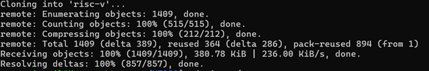
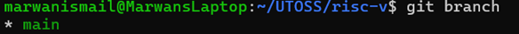
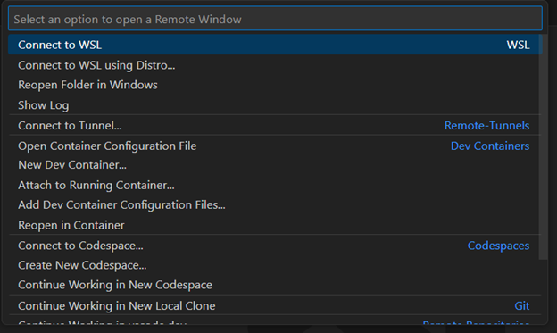

# UTOSS RISC-V Project Onboarding

The purpose of this document is to quickly and seamlessly get set up and begin contributing to the RISC-V open-source processor project with the University of Toronto Open-Source Society. This guide is a work-in-progress so it will be updated with more information that I gather.


# Table of Contents
1. [Installing WSL](#installing-wsl)
2. [Adding an SSH Key to your GitHub Account](#adding-an-ssh-key-to-your-github-account)
3. [Cloning the RISC-V Project](#cloning-the-risc-v-project)
4. [Installing VSCode and Opening the Repo in WSL](#installing-vscode-and-opening-the-repo-in-wsl)
5. [Working with Branches](#working-with-branches)


## Installing WSL

The first step is to install Windows Subsystem for Linux, which will be a convenient tool for using VSCode and Git. Details of how to install it can be found here: [Installing WSL](https://learn.microsoft.com/en-us/windows/wsl/install)
1. Open a Windows commmand prompt terminal as an Administrator
2. Type ```wsl --install Ubuntu-22.04```
3. You will be prompted to create a new UNIX 
4. Type ```wsl --set-default-version 2``` to use WSL2
5. Once registered, the installation will be complete. Close the terminal
6. To open WSL2 again, open a Windows terminal and type ```wsl -d Ubuntu-22.04```

## Adding an SSH Key to your GitHub Account

GitHub uses Git to manage repositories. Some common actions you can perform in GitHub will be:
1.	Cloning a repository with ```git clone <url>```
2.	Pulling from a repository to update where you are on a branch with ```git pull```
3.	Checking out a branch with ```git checkout <branch_name>```
4.  Staging changes with ```git add <file>```
5.	Committing changes with ```git commit <file> -m "message"```
6.	Pushing changes with ```git push origin <branch_name>```
6.	Creating branches with ```git branch <branch_name>```
7.	Checking which branch you are on with ```git branch```
8.	Creating and reviewing pull (merge) requests on the GitHub website

To be able to perform anything on a repository using Git, you need to attach an SSH key to your computer and your GitHub account. Secure-Shell Protocol is a way to securely communicate between your remote repository and your local system. I have found that adding an SSH key can be tricky on the first try, so please follow these instructions and hopefully it will work:
1. Open a Windows command prompt and type ```wsl -d Ubuntu-22.04```
    - This will open the WSL2 terminal for you, which should look like this: 

### Generating an SSH Key

Follow this page for more information: [Generating an SSH Key](https://docs.github.com/en/authentication/connecting-to-github-with-ssh/generating-a-new-ssh-key-and-adding-it-to-the-ssh-agent)

2. Type `ssh-keygen -t ed25519 -C “example@example.com”` into your WSL command prompt, replacing the email with your GitHub account email
3. Press Enter when it says `Enter file in which to save the key (/home/$USER/.ssh/id_ed25519)` to save your key to the default directory
4. When prompted, enter a passphrase you will remember (or enter to continue without a passphrase) and verify that that is your passphrase by typing it again when prompted
    - It is not recommended to proceed without a passphrase for security reasons

### Adding the SSH Key
Then, follow this guide: [Adding a New SSH Key](https://docs.github.com/en/authentication/connecting-to-github-with-ssh/adding-a-new-ssh-key-to-your-github-account)

5. In your WSL terminal, type in `cd /home/USER/` where `USER` is your WSL username that you configured when you installed WSL
6. Type `clip.exe < ~/.ssh/id_ed25519.pub` to copy the contents of your public key to your clipboard
7. Go to GitHub  My Account  Settings  SSH and GPG Keys and add your key
    - Add the SSH key, name it, and paste the contents of the public key you copied into the field specified

### Testing your SSH Connection
Lastly, follow this guide as well: [Testing your SSH Connection](https://docs.github.com/en/authentication/connecting-to-github-with-ssh/testing-your-ssh-connection)

8. Test your SSH connection by typing `ssh -T git@github.com` which should then say:
    - `“The authenticity of host 'github.com (140.82.114.4)' can't be established.`
    - `ED25519 key fingerprint is <your_key_fingerprint_here>`
    - `This key is not known by any other names`
    - `Are you sure you want to continue connecting (yes/no/[fingerprint])? yes`
    - `Warning: Permanently added 'github.com' (ED25519) to the list of known hosts.`
    - `Enter passphrase for key '/home/USER/.ssh/id_ed25519':`
    - `Hi <GitHub_username>! You've successfully authenticated, but GitHub does not provide shell access.`

If you reach this point, then you have successfully added your SSH key to your WSL system, which will allow you to interact with the RISC-V project repository and all other repos you want to work with in the future. You must open WSL to use Git in this configuration, which can be done with Step 1 of this section.

## Cloning the RISC-V Project
Once you have configured your SSH keys, you can now clone the risc-v repository to your own local WSL storage. To do so, use your WSL terminal to:
1. Type `git clone https://github.com/UTOSS/risc-v.git`
    - It should then clone the project as follows:
    - 
2. Once that is done, check that you are up to date on the branch by first typing  `git branch`
    - This should tell you that you are on the main branch:
    - 
3. If you want to update your branch, type `git pull`
    - This should show you that thge branch either has been updated or was already up-to-date

## Installing VSCode and Opening the Repo in WSL 
Once you have cloned the repo in WSL, you can open it using VSCode. To do so, you need to:
1. Install VSCode through this link: [Download VSCode](https://code.visualstudio.com/download)
2. Open VSCode and download the WSL extension
3. Restart VSCode when prompted to enable WSL in VSCode
4. In the bottom-left corner, there is this button: , click on it and you will get this menu:

5. Click on “Connect to WSL” and it will open your WSL
6. Once WSL opens in VSCode, click on "Open Folder" and navigate to the directory in which you cloned the repo
7. This should allow you to open the repo in VSCode and now you can view the repo, edit it, and push your changes

## Working with Branches
It should be noted that we do not push to the main branch. Rather, you must create your own branch, make your changes, and then create a pull request (PR) to merge your changes with the main branch. To create your own branch, do the following in your WSL terminal:
1. Type `git branch <branch_name>` to create your branch
2. Type `git checkout <branch_name>` to switch from the main branch to the branch you just made
3. Make your changes to the repo
4. Type `git add <file>` to stage each file that you changed/added/deleted
5. Type `git commit <file> -m "<message>"` to commit your staged changes and replace `<message>` with a description of your changes
6. Type `git push origin <branch_name>` to push your changes to your branch